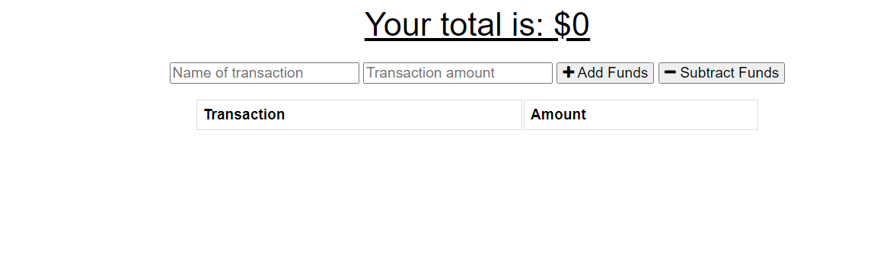

# Progressive Web App - Budget Tracker

## Instructions:

## Details:
PWA that allows for finance tracking both online and offline!

### Updated existing budget tracker provided by bootcamp to include:
The ability to enter deposits offline
The ability to enter expenses offline
Automatic adding of offline entries when application user is online
## Tools Used:

- VSCode
- JavaScript
- Node.JS
- IndexedDB
- Heroku

## Website:

https://budget-tracker-pwa-rc.herokuapp.com/

### Preview:

### Author:

Raymond Cerney

### License

This project is licensed under [MIT](https://opensource.org/licenses/MIT)

### Contact:

cerne004@gmail.com

LinkedIn: https://www.linkedin.com/in/raymondcerney/
